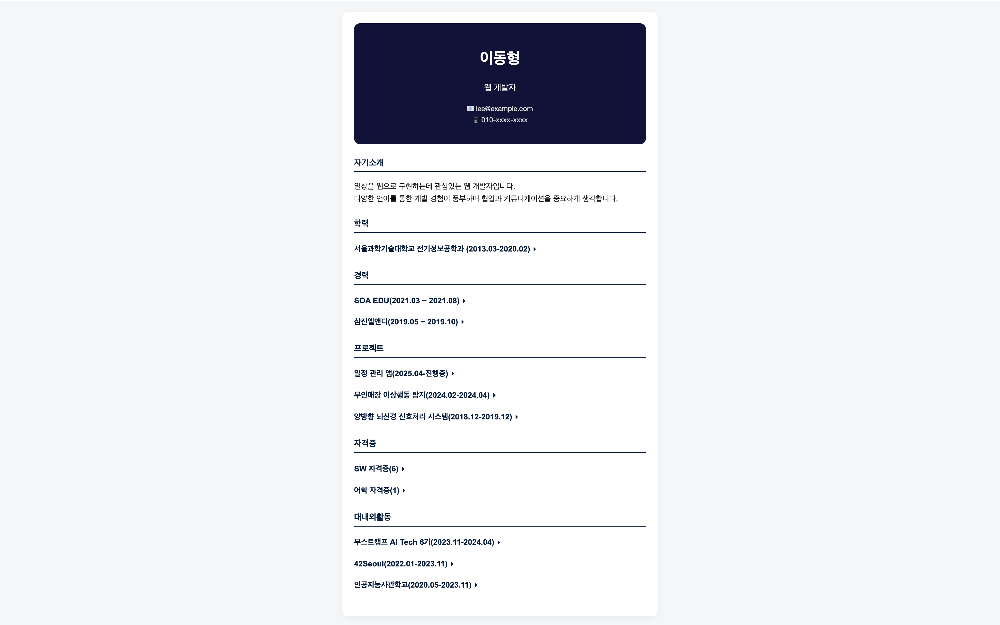

# Profile

## Description
HTML, CSS, JavaScript를 Resume 제작

## 버전별 특징
- [v1](./profile_v1/)
- [v2](./profile_v2): 기본 이력서 양식

## How To Use
1) repository 다운받기
```
git clone https://github.com/cogito30/js_profile.git
```
2) 버전별 폴더로 이동
```
cd <버전별 폴더>
```
3) index.html를 브라우저로 열기

## Result


