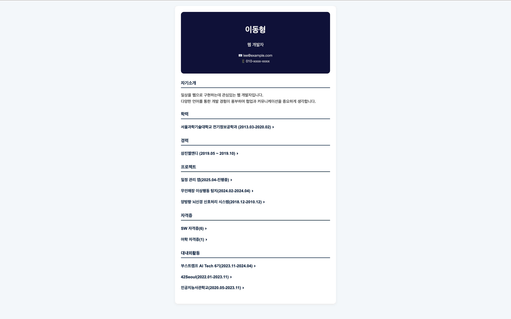

# Profile

## Description
HTML, CSS, JavaScript를 Resume 제작

## 기능
- 프로필 사진 & 이름
- 직무
- 연락처 정보
- 자기소개
- 학력 / 경력
- 프로젝트
- 자격증 / 대내외활동

## How To Use
1) repository 다운받기
```
git clone https://github.com/cogito30/js_profile2.git
```
2) index.html를 브라우저로 열기

## Result

